# MIDS_W209_Information_Visualization_Slides

Slides for the W209 Information Visualization course of the Masters in Data Science at UC Berkeley

## Week 01: Introduction

<!-- [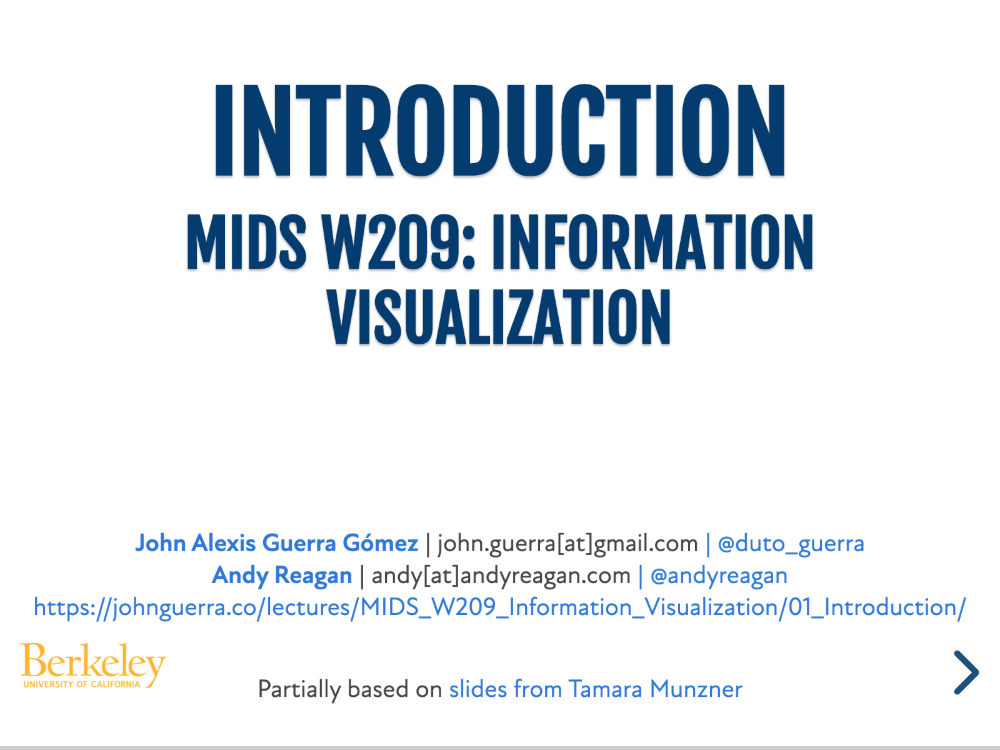](01_Introduction/index.html)
Use the following for width-->

### Slides

### Software Demos

<iframe width="560" height="315" src="https://www.youtube.com/embed/jJD7qP_oCSs" frameborder="0" allow="accelerometer; autoplay; clipboard-write; encrypted-media; gyroscope; picture-in-picture" allowfullscreen></iframe>

## Week 02: What

### Slides

<a href="02_What/index.html">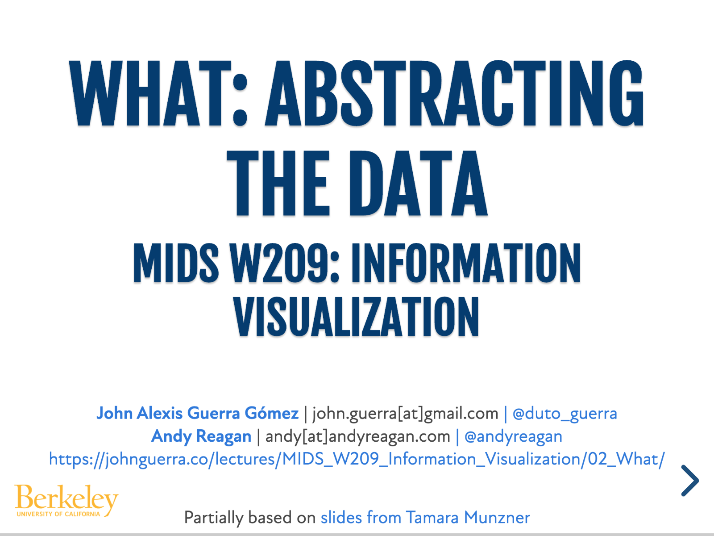</a>

### Software Demos

## Week 03: Why

### Slides

<a href="03_Why/index.html">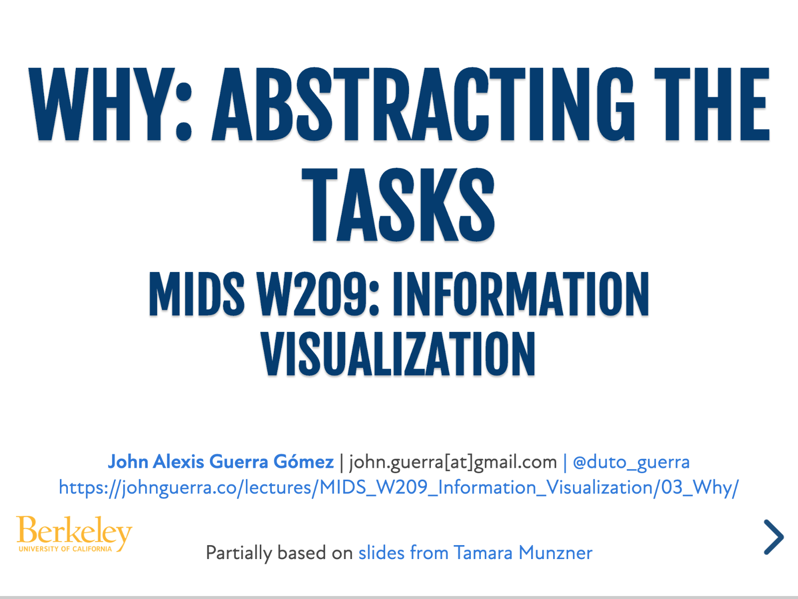</a>

### Software Demos

## Week 04: How

### Slides

<a href="04_How/index.html">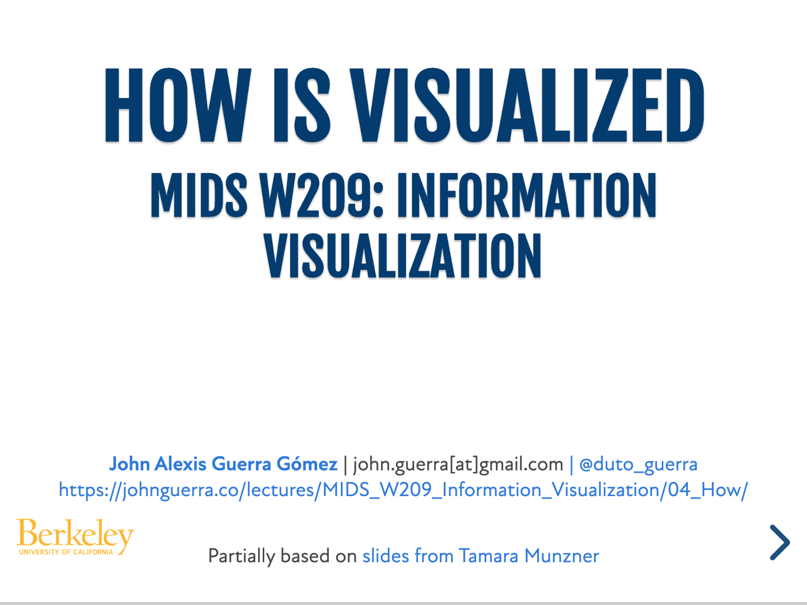</a>

### Software Demos

## Week 05: Rules_of_thumb

### Slides

<a href="05_Rules_of_thumb/index.html">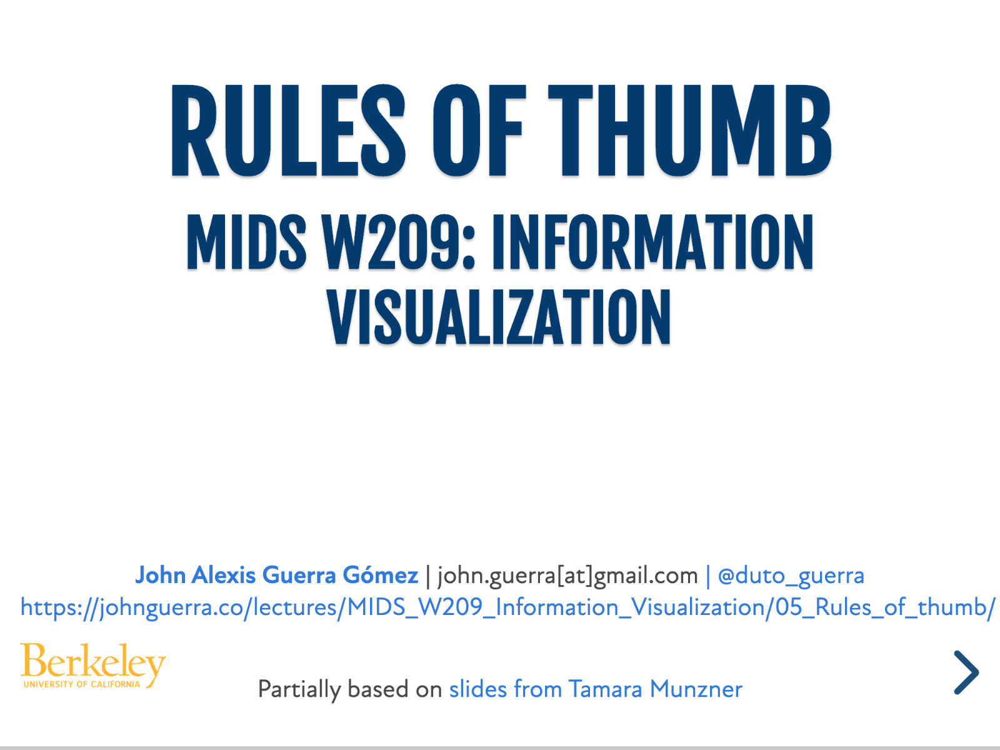</a>

### Software Demos

## Week 06: Tabular

### Slides

### Software Demos

## Week 07: Time

### Slides

<a href="07_Time/index.html">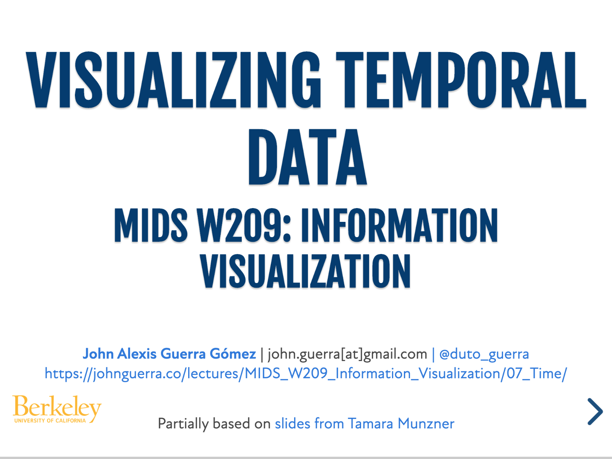</a>

### Software Demos

Time with `d3` [scratchbook](https://observablehq.com/d/f7cc07f685a60ba9?collection=@berkeleyvis/scratchbooks) and video:

<iframe width="560" height="315" src="https://www.youtube.com/embed/0KmFkexJGIo" frameborder="0" allow="accelerometer; autoplay; clipboard-write; encrypted-media; gyroscope; picture-in-picture" allowfullscreen></iframe>

Time with `vega-lite` [scratchbook](https://observablehq.com/d/25c168f39acb668b?collection=@berkeleyvis/scratchbooks) and video:

<iframe width="560" height="315" src="https://www.youtube.com/embed/epsBLcPaSNk" frameborder="0" allow="accelerometer; autoplay; clipboard-write; encrypted-media; gyroscope; picture-in-picture" allowfullscreen></iframe>

Time with `altair` [scratchbook]() and video:

Time with `tableau`:

<iframe width="560" height="315" src="https://www.youtube.com/embed/94Q0nbUQsVU" frameborder="0" allow="accelerometer; autoplay; clipboard-write; encrypted-media; gyroscope; picture-in-picture" allowfullscreen></iframe>

## Week 08: Networks_and_Color

### Slides

<a href="08_Networks_and_Color/index.html">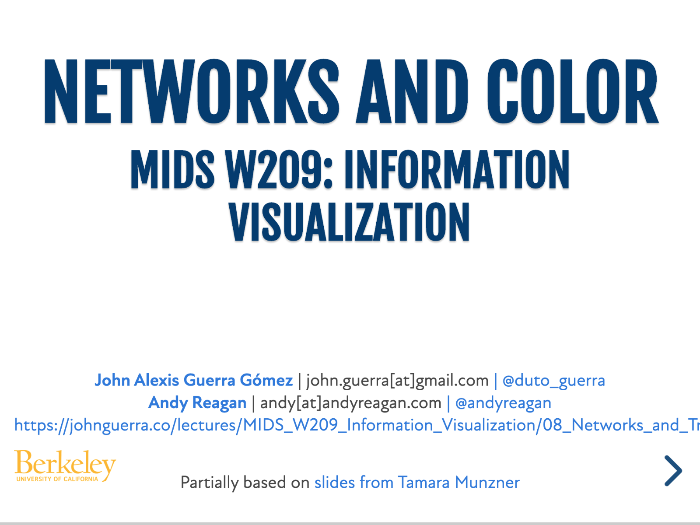</a>

### Software Demos

Networks with `d3` [scratchbook]() and video:

<iframe width="560" height="315" src="https://www.youtube.com/embed/YoHVbUk4wgc" frameborder="0" allow="accelerometer; autoplay; clipboard-write; encrypted-media; gyroscope; picture-in-picture" allowfullscreen></iframe>

Networks with `vega-lite` [scratchbook](https://observablehq.com/d/3cdbca683751979f?collection=@berkeleyvis/scratchbooks) and video:

<iframe width="560" height="315" src="https://www.youtube.com/embed/sZ3dwB-weg8" frameborder="0" allow="accelerometer; autoplay; clipboard-write; encrypted-media; gyroscope; picture-in-picture" allowfullscreen></iframe>

Networks with `altair` [scratchbook]() and video:

Networks with `tableau`:

<iframe width="560" height="315" src="https://www.youtube.com/embed/XXPwM8adHS8" frameborder="0" allow="accelerometer; autoplay; clipboard-write; encrypted-media; gyroscope; picture-in-picture" allowfullscreen></iframe>

Color with `d3` [scratchbook]() and video:

<iframe width="560" height="315" src="https://www.youtube.com/embed/EFIdb64nKeQ" frameborder="0" allow="accelerometer; autoplay; clipboard-write; encrypted-media; gyroscope; picture-in-picture" allowfullscreen></iframe>

Color with `vega-lite`:

<iframe width="560" height="315" src="https://www.youtube.com/embed/hnt6DhZYCUE" frameborder="0" allow="accelerometer; autoplay; clipboard-write; encrypted-media; gyroscope; picture-in-picture" allowfullscreen></iframe>

Color with `altair` [scratchbook]() and video:

Color with `tableau`:

<iframe width="560" height="315" src="https://www.youtube.com/embed/LenAuXemwx0" frameborder="0" allow="accelerometer; autoplay; clipboard-write; encrypted-media; gyroscope; picture-in-picture" allowfullscreen></iframe>

## Week 09: Trees_and_Geo

### Slides

<a href="09_Trees_and_Geo/index.html">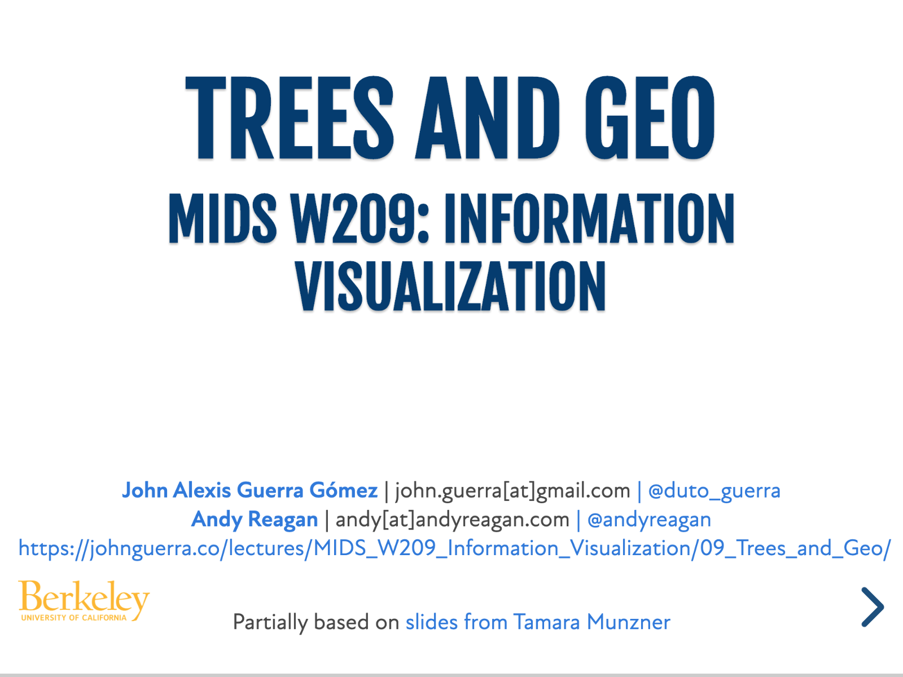</a>

### Software Demos

Trees with `d3` [scratchbook](https://observablehq.com/@berkeleyvis/d3-tree-visualizations?collection=@berkeleyvis/scratchbooks) and video:

<iframe width="560" height="315" src="https://www.youtube.com/embed/-Cf6AGs02x4" frameborder="0" allow="accelerometer; autoplay; clipboard-write; encrypted-media; gyroscope; picture-in-picture" allowfullscreen></iframe>

Trees with `vega-lite` [scratchbook](https://observablehq.com/d/a10de7fe1938aad6?collection=@berkeleyvis/scratchbooks) and video:

<iframe width="560" height="315" src="https://www.youtube.com/embed/xswb_WjYFj0" frameborder="0" allow="accelerometer; autoplay; clipboard-write; encrypted-media; gyroscope; picture-in-picture" allowfullscreen></iframe>

Trees with `altair` [scratchbook]() and video:

Trees with `tableau`:

<iframe width="560" height="315" src="https://www.youtube.com/embed/XBblGbjXQmg" frameborder="0" allow="accelerometer; autoplay; clipboard-write; encrypted-media; gyroscope; picture-in-picture" allowfullscreen></iframe>

Geo with `d3` [scratchbook]() and video:

<iframe width="560" height="315" src="https://www.youtube.com/embed/opbjh4DX5so" frameborder="0" allow="accelerometer; autoplay; clipboard-write; encrypted-media; gyroscope; picture-in-picture" allowfullscreen></iframe>

Geo with `vega-lite` [scratchbook](https://observablehq.com/d/25c168f39acb668b?collection=@berkeleyvis/scratchbooks) and video:

<iframe width="560" height="315" src="https://www.youtube.com/embed/wx5SZG-aPDI" frameborder="0" allow="accelerometer; autoplay; clipboard-write; encrypted-media; gyroscope; picture-in-picture" allowfullscreen></iframe>

Geo with `altair` [scratchbook]() and video:

Geo with `tableau` and `mapbox`:

<iframe width="560" height="315" src="https://www.youtube.com/embed/GY1eJy5QT1w" frameborder="0" allow="accelerometer; autoplay; clipboard-write; encrypted-media; gyroscope; picture-in-picture" allowfullscreen></iframe>

## Week 10: Manipulate_Views

### Slides

<a href="10_Manipulate_Views/index.html">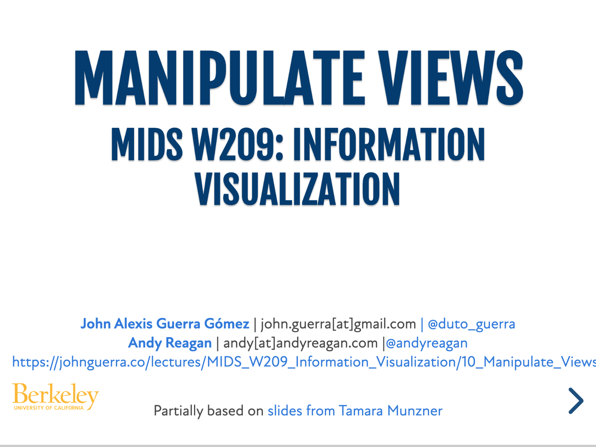</a>

### Software Demos

Animations with `vega-lite`:

<iframe width="560" height="315" src="https://www.youtube.com/embed/hfE_iuzDYwY" frameborder="0" allow="accelerometer; autoplay; clipboard-write; encrypted-media; gyroscope; picture-in-picture" allowfullscreen></iframe>

## Week 11: Faceting

### Slides

<a href="11_Faceting/index.html">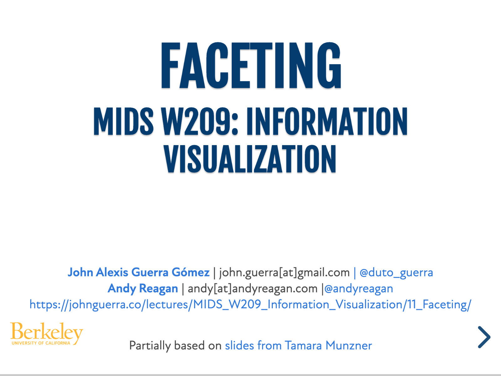</a>

### Software Demos

Faceting with `d3`:

<iframe width="560" height="315" src="https://www.youtube.com/embed/fClfsNt_9ww" frameborder="0" allow="accelerometer; autoplay; clipboard-write; encrypted-media; gyroscope; picture-in-picture" allowfullscreen></iframe>

Faceting with `vega-lite`:

<iframe width="560" height="315" src="https://www.youtube.com/embed/Bo9BV9BsPwU" frameborder="0" allow="accelerometer; autoplay; clipboard-write; encrypted-media; gyroscope; picture-in-picture" allowfullscreen></iframe>

Faceting with `altair`:

Faceting with `tableau`:

<iframe width="560" height="315" src="https://www.youtube.com/embed/hr25pbwqy0c" frameborder="0" allow="accelerometer; autoplay; clipboard-write; encrypted-media; gyroscope; picture-in-picture" allowfullscreen></iframe>

## Week 12: Evaluation

### Slides

<a href="12_Evaluation/index.html">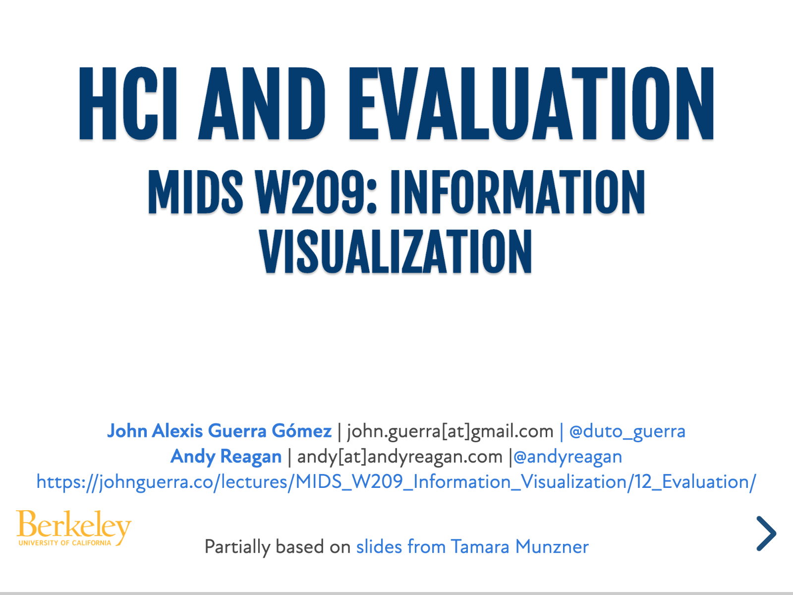</a>

### Software Demos

## Week 13: Reducing

### Slides

### Software Demos

## Week 14: Advanced

### Slides

<a href="14_Advanced/index.html">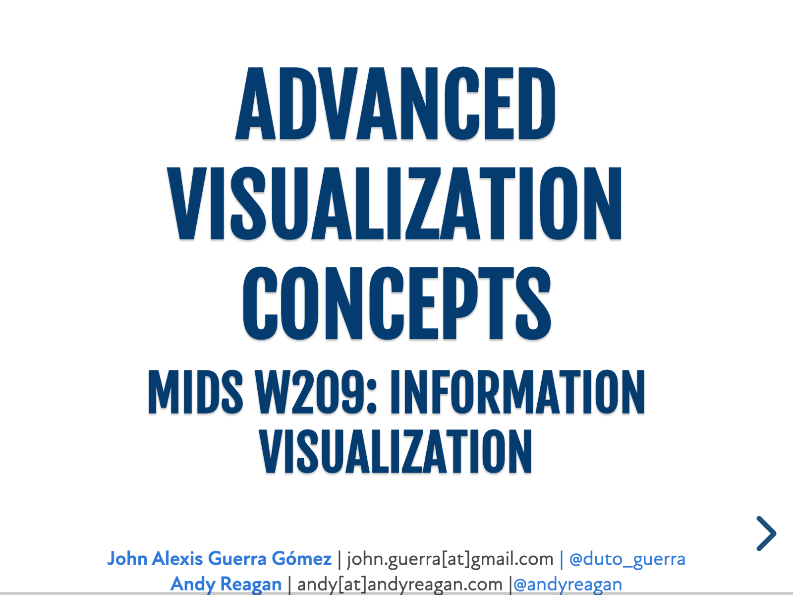</a>

### Software Demos
